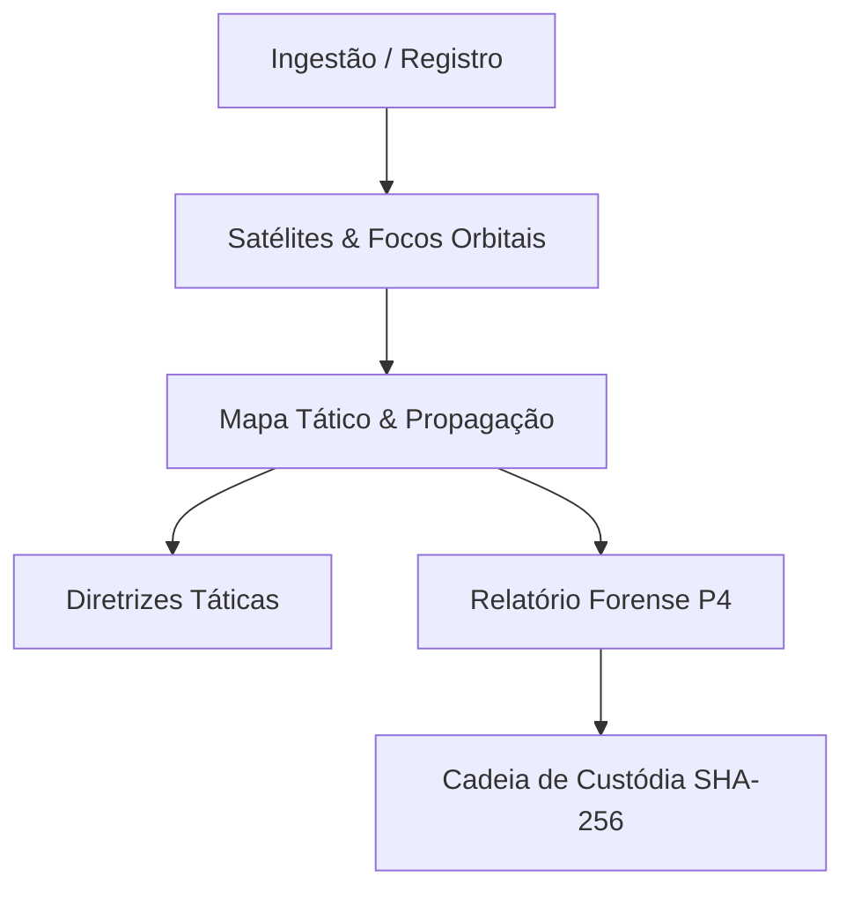

# SIMIA-Verde — Manual do Usuário e Instrução Operacional

> **Sistema Integrado de Monitoramento, Inteligência Ambiental e Instrução Forense**  
> *Padrão de Conformidade: SENASP / Ministério da Justiça e Segurança Pública (MJSP)*  
> *Enquadramento Legal: Lei Federal nº 9.605/1998 (Lei de Crimes Ambientais, Arts. 41 e 42), Art. 250 do Código Penal e CPP (Arts. 158-A a 158-F — Cadeia de Custódia).*

---

## 📑 Sumário

1. [Apresentação e Finalidade](#1-apresentação-e-finalidade)
2. [Arquitetura de Fontes Oficiais Integradas](#2-arquitetura-de-fontes-oficiais-integradas)
3. [Fluxo Operacional de Uso (Passo a Passo)](#3-fluxo-operacional-de-uso-passo-a-passo)
   - [3.1 Ingestão e Registro de Ocorrência](#31-ingestão-e-registro-de-ocorrência)
   - [3.2 Satélites & Órbitas (SIPAM, INPE e NASA)](#32-satélites--órbitas-sipam-inpe-e-nasa)
   - [3.3 Mapa Tático & Análise de Propagação](#33-mapa-tático--análise-de-propagação)
   - [3.4 Relatório Forense P4 (Laudo Pericial Oficial)](#34-relatório-forense-p4-laudo-pericial-oficial)
   - [3.5 Diretrizes Táticas Integradas (Tripartite)](#35-diretrizes-táticas-integradas-tripartite)
   - [3.6 Cadeia de Custódia e Validador Criptográfico SHA-256](#36-cadeia-de-custódia-e-validador-criptográfico-sha-256)
   - [3.7 Conectores & APIs Governamentais](#37-conectores--apis-governamentais)
   - [3.8 Decisões Relevantes e Consulta ao Usuário](#38-decisões-relevantes-e-consulta-ao-usuário)
4. [Tríplice Validação Forense (SIPAM x INPE x NASA)](#4-tríplice-validação-forense-sipam-x-inpe-x-nasa)
5. [Instalação e Execução Local](#5-instalação-e-execução-local)
6. [Variáveis de Ambiente](#6-variáveis-de-ambiente)
7. [Protocolos de Segurança e Preservação de Evidências](#7-protocolos-de-segurança-e-preservação-de-evidências)

---

## 1. Apresentação e Finalidade

O **SIMIA-Verde** é uma plataforma desenvolvida para subsidiar a atuação integrada das forças de segurança pública e de fiscalização ambiental:
- **Polícia Civil e Federal (Polícia Judiciária):** Instrução de inquéritos policiais de queimadas criminosas, delimitação de nexo causal e identificação de autoria;
- **Polícia Técnico-Científica (Perícia Criminal):** Emissão de Laudos Periciais com rastreabilidade, modelo de dispersão física do fogo e validação criptográfica (SHA-256);
- **Corpo de Bombeiros Militar:** Planejamento tático de combate, estimativa de velocidade de propagação e análise do risco de reignição;
- **Polícia Militar Ambiental e Órgãos de Fiscalização (IBAMA/ICMBio/CPRH/Polícia Ambiental Estadual):** Fiscalização em campo, averiguação de autorizações de queima controlada e sobreposição com imóveis do Cadastro Ambiental Rural (CAR).

---

## 2. Arquitetura de Fontes Oficiais Integradas

O sistema integra, em tempo real e de forma transparente, dados abertos e oficiais das seguintes instituições:

| Órgão / Agência | Sistema / API | Função Pericial no SIMIA-Verde | Chave de Acesso |
| :--- | :--- | :--- | :--- |
| **CENSIPAM / Ministério da Defesa** | **SIPAM — Painel do Fogo** | Eventos consolidados com polígonos, persistência de até 30 dias e sobreposição ao CAR, Terras Indígenas e Unidades de Conservação. | Aberta / Sem Chave |
| **INPE / MCTI** | **BDQueimadas** | Focos de calor orbitais nas últimas 24 horas, classificação oficial do satélite de referência (AQUA) e compatibilidade com biomas. | Aberta / Sem Chave |
| **NASA / EOSDIS / LANCE** | **NASA FIRMS** | Detecções de alta resolução (375m) via sensores VIIRS (NOAA-20/21 e Suomi-NPP) com Potência Radiativa do Fogo (FRP em MW). | MAP_KEY gratuita |
| **Open-Meteo & ERA5 / CPTEC** | **API Meteorológica** | Séries meteorológicas históricas e em tempo real (velocidade/direção do vento, umidade relativa, temperatura e FWI). | Aberta / Sem Chave |
| **IBGE** | **Malhas Territoriais** | Geocodificação reversa, limites municipais oficiais e determinação de comarca judicial. | Aberta / Sem Chave |

---

## 3. Fluxo Operacional de Uso (Passo a Passo)



### 3.1 Ingestão e Registro de Ocorrência
Acesse a aba **"Nova Ocorrência"** na barra lateral.

1. **Definição da Localização:**
   - **Coordenadas Decimais:** Insira Latitude e Longitude (ex: `-21.1767, -47.8208`).
   - **Coordenadas UTM:** Se a equipe de campo utilizou GPS em UTM, altere para "Coordenadas UTM" e insira Fuso (ex: `23`), Hemisfério (`Sul`), Easting e Northing. O sistema faz a conversão automática para WGS-84.
   - **Busca por Município (IBGE):** Digite o nome do município (ex: `Ribeirão Preto`) e selecione na lista para carregar as coordenadas centrais.
   - **Atalhos Rápidos:**
     - Botão *"Focos INPE (UF)"*: consulta os focos detectados nas últimas 24h pelo INPE e permite o preenchimento em 1 clique.
     - Botão *"Eventos SIPAM 30d (UF)"*: consulta eventos de queima contínua consolidados pelo CENSIPAM nos últimos 30 dias (limite máximo regulamentar).

2. **Georreferenciamento e Município:**
   - Ao alterar as coordenadas, o sistema executa a geocodificação reversa automática, identificando Município, UF e Comarca Judicial competente.

3. **Contexto Operacional e Investigativo:**
   - **Data e Hora do Fato:** Registre o instante da constatação (ou momento de passagem orbital).
   - **Autorização Ambiental:** Verifique se há autorização de queima controlada cadastrada (`NÃO LOCALIZADA`, `LOCALIZADA - VÁLIDA`, `EXPIRADA` ou `SUSPENSA`).
   - **Tipologia da Vegetação:** Indique o bioma e a cultura (Cana-de-açúcar, Pastagem, Mata Atlântica nativa, Cerrado, etc.).
   - **Indícios de Ação Humana:** Aponte vestígios de dolo (múltiplos focos alinhados contra o vento, garrafas com acelerante químico, queima fora do horário permitido).

4. **Processamento Inicial:**
   - Clique em **"Processar Ocorrência e Gerar Dossiê"**. O motor do SIMIA-Verde calculará instantaneamente o risco meteorológico (FWI), vetores de propagação e abrirá o dossiê.

---

### 3.2 Satélites & Órbitas (SIPAM, INPE e NASA)
Acesse a aba **"Satélites & Focos"**. Esta tela possui 4 visualizações complementares:

#### Sub-aba 1: SIPAM Painel do Fogo (CENSIPAM / Ministério da Defesa)
- **Filtro de Janela Temporal:** Selecione entre **1 e 30 dias** (com botões de atalho: 30d Máx, 15d, 7d, 48h e 24h).
- **Filtro Geográfico:** Selecione a UF desejada (todas as 27 UFs brasileiras) ou filtre por município do IBGE.
- **Modos de Exibição:**
  1. *Eventos de Fogo Consolidados:* Mostra polígonos de queima contínua, persistência em dias, área calculada em km² e hectares, e cruzamento com Unidades de Conservação e Terras Indígenas.
  2. *Dossiê do Evento (Modal CAR):* Clique em **"Ver Imóveis CAR & Detecções"** para inspecionar os códigos SICAR dos imóveis rurais atingidos, facilitando a intimação do proprietário pelo Delegado de Polícia.
  3. *Focos CENSIPAM / FIRMS:* Focos pontuais diretos recebidos pelas antenas operadas pelo CENSIPAM.
- **Ação Pericial:** Clique em **"Instruir Dossiê Pericial"** para vincular qualquer evento diretamente à ocorrência ativa.

#### Sub-aba 2: INPE BDQueimadas (Brasil / MCTI)
- Monitoramento de focos de calor nas últimas 24 horas via satélite de referência (AQUA) e satélites geoestacionários (GOES-16).
- Filtro por estado, bioma e satélite.
- Ingestão direta com 1 clique para o dossiê do SIMIA-Verde.

#### Sub-aba 3: NASA FIRMS (EUA / LANCE)
- Detecções de altíssima precisão métrica (375 metros) pelos sensores VIIRS.
- Leitura de **Potência Radiativa do Fogo (FRP em MW)** e temperatura de brilho (Brightness Temperature).
- Área de abrangência configurável: raio de 25 km a 200 km em torno do local do fato.

#### Sub-aba 4: Tríplice Validação Forense
- Matriz técnica que compara a acurácia, resolução espacial e valor jurídico entre **SIPAM**, **INPE** e **NASA**, orientando a redação da peça pericial.

---

### 3.3 Mapa Tático & Análise de Propagação
Acesse a aba **"Mapa Tático"**.

1. **Rosa dos Ventos e Condições Atmosféricas:**
   - Exibe a direção de origem do vento e a velocidade (km/h e m/s).
   - Mostra umidade relativa do ar e índice de risco de fogo.
2. **Modelagem Elíptica de Propagação:**
   - Simula o cone de avanço provável das chamas segundo as variáveis meteorológicas e declividade do terreno.
   - **Eixo Principal:** Direção para onde as chamas avançam com maior intensidade.
   - **Back-Tracking:** Linha pontilhada em direção contrária ao vento, indicando o quadrante provável do ponto de ignição inicial.
3. **Alternância de Camadas:**
   - Alterne entre visualização de Terreno (OpenStreetMap) e Satélite de Alta Resolução (Esri World Imagery).

---

### 3.4 Relatório Forense P4 (Laudo Pericial Oficial)
Acesse a aba **"Relatório Forense"**.

1. **Estrutura Padronizada do Laudo Pericial:**
   - **Preâmbulo:** Identificação do perito/operador, número do inquérito/BO, autoridade requisitante e comarca judicial.
   - **Localização Técnica:** Coordenadas WGS-84, conversão UTM, município e comarca.
   - **Condições Meteorológicas no Momento do Fato:** Vento, temperatura, umidade e FWI.
   - **Evidências Orbitais (SIPAM / INPE / NASA):** Cruzamento dos registros de satélites com FRP e persistência.
   - **Sobreposição Fundiária (CAR):** Identificação de imóveis rurais e conformidade com queima controlada.
   - **Análise Dinâmica do Fogo:** Vetor de propagação, ponto de ignição estimado e velocidade calculada.
   - **Enquadramento Jurídico:** Arts. 41 e 42 da Lei 9.605/98 e Art. 250 do CP.
   - **Conclusão Pericial e Respostas aos Quesitos:** Parecer conclusivo sobre dolo, negligência ou queima autorizada.
2. **Exportação e Impressão:**
   - Clique em **"Imprimir / Salvar PDF"** para abrir o diálogo de impressão do navegador já pré-formatado em folha A4 com cabeçalho oficial da SENASP.
   - Clique em **"Copiar Markdown"** para exportar o texto integral para sistemas de processo eletrônico (e-SAJ, PJe, Projudi).

---

### 3.5 Diretrizes Táticas Integradas (Tripartite)
Acesse a aba **"Diretrizes Táticas"**. Esta tela gera recomendações automáticas específicas para cada força:

1. **Corpo de Bombeiros Militar:**
   - Dimensionamento de linhas de combate direto e indireto (aceiros).
   - Posicionamento da viatura a barlavento (contra a fumaça).
   - Previsão de virada de vento e risco de aprisionamento de equipes.
2. **Policiamento Ostensivo e Ambiental:**
   - Pontos de bloqueio viário e rotas de fuga de suspeitos.
   - Fiscalização imediata de propriedades confinantes e queima sem autorização.
3. **Polícia Judiciária e Perícia Criminal:**
   - Quesitos periciais prioritários.
   - Preservação do ponto provável de início (quadrante inicial).
   - Notificação do proprietário do imóvel registrado no CAR para apresentação de documentos.

---

### 3.6 Cadeia de Custódia e Validador Criptográfico SHA-256
Acesse a aba **"Cadeia de Custódia"**.

1. **Rastreabilidade e Não-Repúdio:**
   - Em conformidade estrita com o Art. 158-A do Código de Processo Penal.
   - Cada ocorrência gera automaticamente um **Hash Criptográfico SHA-256** único baseado nos dados periciais brutos, coordenadas e timestamp UTC.
2. **Etapas Registradas:**
   - *Fixação:* Registro inicial das coordenadas e horário.
   - *Coleta:* Ingestão dos dados de satélite e meteorologia.
   - *Acondicionamento:* Geração do dossiê digital imutável.
3. **Validador de Integridade (Checksum):**
   - Ferramenta embutida para re-calcular o hash SHA-256 de qualquer texto ou laudo pericial exportado, garantindo perante a Defensoria, Ministério Público e Juiz que o documento não sofreu adulteração posterior.

---

### 3.7 Conectores & APIs Governamentais
Acesse a aba **"Conectores & APIs"**.

- Diagnóstico em tempo real da saúde das conexões:
  - **SIPAM Painel do Fogo:** Latência e status da API do CENSIPAM.
  - **INPE BDQueimadas:** Acesso ao endpoint público de focos CSV/JSON.
  - **Open-Meteo:** Disponibilidade do serviço meteorológico.
  - **IBGE:** Conexão com a malha municipal.
  - **NASA FIRMS:** Validação da MAP_KEY configurada.
- Clique em **"Testar Conexão"** em qualquer conector para inspecionar os pacotes JSON retornados.

---

### 3.8 Decisões Relevantes e Consulta ao Usuário
Acesse a aba **"Decisões Relevantes"**.

- Registro das premissas técnicas adotadas durante o desenvolvimento e perícia:
  - Decisão pelo uso prioritário de APIs governamentais sem autenticação restrita;
  - Limite regulamentar do SIPAM estabelecido em 30 dias (máximo);
  - Adoção da resolução de 375m da constelação VIIRS;
  - Não inclusão de dados fictícios em conformidade com o princípio da verdade material pericial.

---

## 4. Tríplice Validação Forense (SIPAM x INPE x NASA)

Para a sustentação da denúncia criminal pelo Ministério Público ou emissão do Laudo pelo Perito Criminal Oficial, a convergência entre os três sistemas confere presunção de materialidade inabalável:

```
┌─────────────────────────┐     ┌─────────────────────────┐     ┌─────────────────────────┐
│ SIPAM / CENSIPAM (MD)   │     │ INPE BDQueimadas (MCTI) │     │ NASA FIRMS (EUA/LANCE)  │
├─────────────────────────┤     ├─────────────────────────┤     ├─────────────────────────┤
│ • Eventos de até 30 dias│     │ • Registro oficial BR   │     │ • Resolução 375m        │
│ • Polígono e área (km²) │ ◄──►│ • Satélite AQUA Ref.    │ ◄──►│ • Potência FRP (MW)     │
│ • Sobreposição CAR/TI/UC│     │ • Histórico 24h         │     │ • Horário exato UTC     │
└─────────────────────────┘     └─────────────────────────┘     └─────────────────────────┘
                                             │
                                             ▼
                     ┌──────────────────────────────────────────────┐
                     │ LAUDO PERICIAL P4 — VALIDADE JURÍDICA PLENA │
                     │ Materialidade Inconteste & Autoria Fundiária │
                     └──────────────────────────────────────────────┘
```

---

## 5. Instalação e Execução Local

### Requisitos Mínimos
- **Node.js:** Versão 18.x ou 20.x LTS
- **Gerenciador de Pacotes:** npm (v9+)
- **Navegador Homologado:** Google Chrome e Microsoft Edge a partir da **versão 109**, Mozilla
  Firefox 115+ ou Safari 15.6+. A versão 109 é a última compatível com Windows 7/8.1 e está
  contemplada: a compilação gera as cores em formato aceito por ela.

### Clonagem e Instalação
```bash
# Instalar todas as dependências do projeto
npm install
```

### Execução em Modo de Desenvolvimento
```bash
# Inicia o servidor full-stack (Express + Vite) na porta 3000
npm run dev
```
Acesse no navegador: `http://localhost:3000`

### Compilação e Execução em Produção
```bash
# Compila a aplicação front-end (Vite) e o servidor back-end (esbuild CJS)
npm run build

# Executa o servidor compilado
npm start
```

### Execução via Docker (recomendado para instalação em unidade)

```bash
# Sobe a stack completa em segundo plano
docker compose up -d

# Acompanhar log operacional
docker compose logs -f simia

# Encerrar (a base pericial é PRESERVADA)
docker compose down
```

Acesse `http://localhost:3000`. Se a porta 3000 já estiver ocupada na estação, defina outra:

```bash
SIMIA_PORT=3300 docker compose up -d
```

Para desenvolvimento com recarga automática (HMR) e o código-fonte montado:

```bash
docker compose --profile dev up -d      # http://localhost:5173
```

A base pericial fica em **`./data/simia.db`**, dentro do próprio projeto (bind mount, não volume
Docker). `docker compose down` preserva os dados; para descartar, apague a pasta manualmente.
O perfil de desenvolvimento usa `./data-dev`, isolado da base de produção.

---

## 5.1 Base Pericial Local (SQLite)

O SIMIA-Verde persiste os dossiês em **duas camadas complementares**:

| Camada | Papel | Persistência |
| :--- | :--- | :--- |
| **LocalStorage** | Cache offline do operador — garante trabalho de campo com conexão intermitente | Navegador da estação |
| **SQLite** | Sistema de registro durável e auditável, com livro de cadeia de custódia | `./data/simia.db` |

Por ser um banco embarcado em arquivo, o SQLite **não exige contêiner próprio**: a base é um arquivo
na pasta `./data` do projeto, montada em `/app/data` no contêiner. Isso mantém a prova acessível,
copiável e sob controle direto da unidade — sem depender do ciclo de vida de volumes do Docker.

### Indicador de Estado na Interface

O cabeçalho exibe permanentemente a situação da persistência:

- 🟢 **BASE SINCRONIZADA** — dossiês gravados com registro de cadeia de custódia no servidor;
- 🟡 **SOMENTE LOCAL** — a base durável está indisponível; os dossiês existem apenas no navegador
  desta estação e **ainda não possuem registro de custódia**.

Na abertura do sistema as duas camadas são reconciliadas: a base durável é a referência, e dossiês
criados offline são enviados a ela. Nenhum dossiê é descartado nessa reconciliação.

### Livro de Cadeia de Custódia (Append-Only)

Em atendimento ao **Art. 158-A do CPP**, a tabela `custodia_eventos` é protegida por *triggers* do
próprio SQLite que **recusam `UPDATE` e `DELETE`**. Cada ato relevante gera um evento imutável:

| Etapa | Quando é registrada |
| :--- | :--- |
| `ACONDICIONAMENTO` | Primeira gravação do dossiê na base |
| `REPROCESSAMENTO` | Reanálise (ex.: atualização meteorológica ao vivo), com o novo hash vigente |
| `REMOCAO` | Exclusão do dossiê da base operacional |

O livro **não** é apagado junto com o dossiê: a própria remoção fica registrada, com operador e
carimbo UTC, preservando a rastreabilidade exigida pela lei.

### Endpoints da Base Pericial

| Método | Rota | Função |
| :--- | :--- | :--- |
| `GET` | `/api/health` | Diagnóstico do serviço e do banco (usado pelo healthcheck do contêiner) |
| `GET` | `/api/ocorrencias` | Lista todos os dossiês persistidos |
| `GET` | `/api/ocorrencias/:id` | Recupera um dossiê específico |
| `POST` | `/api/ocorrencias` | Grava ou atualiza um dossiê e registra o evento de custódia |
| `DELETE` | `/api/ocorrencias/:id` | Remove o dossiê e registra a remoção no livro |
| `GET` | `/api/ocorrencias/:id/custodia` | Consulta o livro de cadeia de custódia da ocorrência |

> **Nota pericial:** o *healthcheck* verifica deliberadamente apenas o processo e o banco. As APIs
> governamentais ficam indisponíveis com frequência — isso é condição operacional prevista e não
> deve marcar o contêiner como insalubre.

---

## 6. Variáveis de Ambiente

As configurações sensíveis e chaves de API devem ser declaradas no arquivo `.env` (use `.env.example` como modelo):

```env
# .env.example

# Chave opcional da NASA FIRMS (obtenha gratuitamente em https://firms.modaps.eosdis.nasa.gov/api/map_key/)
NASA_FIRMS_MAP_KEY=

# Chave opcional para modelos generativos Google Gemini (serviço server-side)
GEMINI_API_KEY=

# Caminho do arquivo SQLite da base pericial.
# Em Docker aponta para o volume persistente; fora de Docker, o padrão é ./data/simia.db
SIMIA_DB_PATH=

# Porta do servidor Express (padrão 3000)
PORT=3000

# Portas expostas no host pelo docker compose
SIMIA_PORT=3000
SIMIA_DEV_PORT=5173
```

> **Nota:** Se a `NASA_FIRMS_MAP_KEY` não for configurada, o sistema continua funcionando plenamente com o **SIPAM Painel do Fogo** e o **INPE BDQueimadas**, que são 100% públicos e dispensam qualquer chave de acesso. O operador também pode inserir a chave da NASA temporariamente pela interface em tempo de execução.

---

## 6.1 Estado Operacional das Fontes Externas

> Verificado em **17/09/2026**. APIs governamentais mudam sem aviso: reconfirme com a aba
> **Conectores & APIs** antes de uma diligência.

| Fonte | Estado | Observação |
| :--- | :--- | :--- |
| **SIPAM Painel do Fogo** (CENSIPAM/MD) | ✅ Operacional | Principal fonte em funcionamento |
| **Open-Meteo** | ✅ Operacional | Meteorologia de grade de reanálise |
| **IBGE / BrasilAPI** | ✅ Operacional | Malhas e municípios |
| **Nominatim** (geocodificação) | ✅ Operacional | Via proxy do servidor |
| **OpenStreetMap Overpass** | ✅ Operacional | Hidrografia e vias; rate limit agressivo |
| **NASA FIRMS** | ⚠️ Requer chave | Gratuita; sem ela o sistema opera com as demais fontes |
| **INPE BDQueimadas** | ✅ Operacional | Via **GeoServer OGC** do TerraBrasilis. Entrega FRP, bioma, vegetação, risco de fogo, dias sem chuva e séries históricas de 2020 a 2025. |
| **INPE — Terras Indígenas e UCs** | ✅ Operacional | Consulta espacial nos polígonos oficiais da FUNAI e do MMA: determina incidência e competência federal. |
| **SIGAMgeo Público (SEMIL-SP)** | ✅ Operacional | Via ArcGIS REST. 571.769 Autos de Infração Ambiental da Polícia Ambiental e Boletins de Ocorrência de Incêndio florestal. Cobertura restrita a São Paulo. |

**Quando uma fonte está fora do ar, o sistema declara a camada como `INDISPONIVEL`** e orienta o
operador sobre como verificar manualmente. Ele **nunca** preenche a lacuna com um valor plausível,
e **nunca** apresenta falha de consulta como ausência de registro.

---

## 7. Protocolos de Segurança e Preservação de Evidências

1. **Isolamento de Credenciais:** Nenhuma chave de API ou credencial governamental é exposta no navegador do usuário; todas as requisições passam pelo proxy seguro local do Node.js (`/api/*`).
2. **Princípio do Isolamento Pericial:** O SIMIA-Verde nunca altera os registros de satélites na fonte; todas as leituras são imutáveis e auditáveis.
3. **Persistência em Duas Camadas:** As ocorrências ficam salvas no navegador em sandbox (permitindo trabalho de campo mesmo com interrupções de conexão) **e** na base pericial durável em SQLite, que mantém o livro imutável de cadeia de custódia. A interface informa permanentemente ao operador qual das duas camadas está vigente.
4. **Respaldo Legal:** Todo o vocabulário e quesitos gerados no relatório seguem as diretrizes técnicas da SENASP (Secretaria Nacional de Segurança Pública) e a doutrina pericial da Polícia Federal.
5. **Princípio da Verdade Material:** O sistema jamais preenche dado não apurado com valor plausível. Toda camada não verificada é declarada `INDISPONIVEL`, com a orientação de como o operador a verifica manualmente. Consulta que falhou **nunca** é apresentada como "nenhum registro encontrado" — a distinção entre *não há* e *não verifiquei* é o que separa um laudo admissível de uma prova falsa.
6. **Isolamento de Credenciais:** A MAP_KEY da NASA trafega por cabeçalho (`x-nasa-map-key`), não por query string, e é mascarada em todo log do servidor.

---

**SIMIA-Verde — Sistema Integrado de Monitoramento, Inteligência Ambiental e Instrução Forense**  
*Desenvolvido para apoio às forças de segurança pública e defesa do patrimônio socioambiental brasileiro.*
